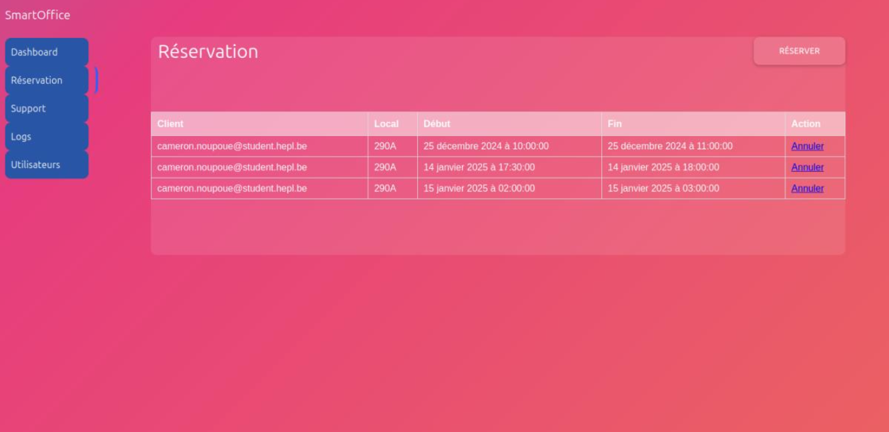

# Smart Office

This is a prototyp.

Smart Office is an IoT Project to practice a lot of IoT's concepts like NodeRed, MQTT, Security, Raspberry Pi, GrovePi, senses, ESP32, LoRa, REST APIs, cloud, Ubuntu, Arduino 

##

To use the scripts, please clone this repository on the same folder than your `.node-red/` directory
## How to run the project

You have to build your certificates 

```bash
./setup_ssl.sh
```

## How to plug sensors

## Structure

The project is divided into four levels
1. The Raspberry (with sensors, LoRa and ESP32)
2. The client (using the RPI)
3. The maintainer (the enterprise who's sell the RPI)
4. The cloud (with data)
  

## Dashboard overview
 
<p align="center">
  
  
</p>
<p align="center">
  
  
</p>

## Authors 

* [Cameron Noupoue](https://cnoupoue.live)
* [Nasser Kotiyev](mailto:nasser.kotiyev@student.hepl.be)

## Credits 

Project devised and created during my studies at the Haute-Ecole de la Province de Liège (HEPL), Belgium.
