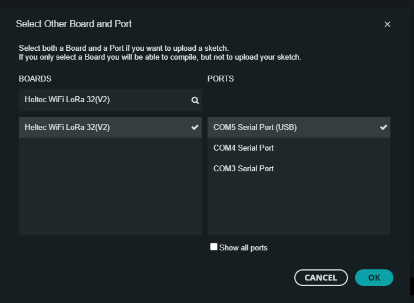
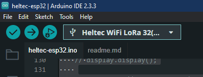

## Pour compiler ESP32
1.  Sélectionner le bon Board

1. Débrancher les capteurs du ESP32 Lora
1. Lancer le transfère

1d:\files\ecole\HEPL\Iot\smart-office\heltec-esp32\heltec-esp32.ino. Rebrancher les capteurs du ESP32 Lora

https://www.youtube.com/watch?v=pI3NV2yPs4c