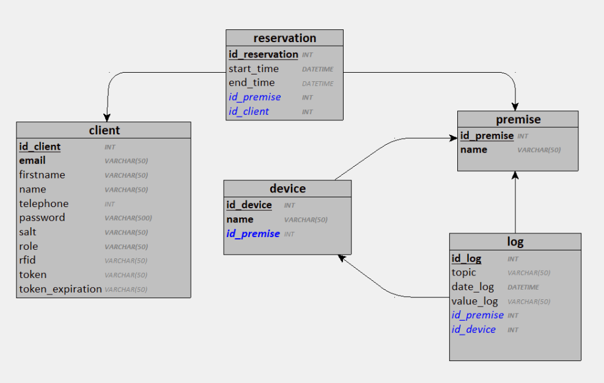

# MongoDB

We use MongoDB as our NoSQL database to store the client, the rooms, the reserved rooms, and the logs

## Scheme

The database schema is available in this repository : `database.png`

## Mongo Instance

We used Docker to containerize our database. 

The Dockerfile is available in this folder.

The credits for the database are : `hepl` and password is `heplhepl`

## Launch the database

`./runapp.sh`

`sudo docker exec -it mongo-client mongosh -u hepl -p heplhepl --authenticationDatabase admin`

> use reservationDB
>
> show collections
>
> db.client.find().pretty();
>
> db.premise.find().pretty();
>
> db.reservation.find().pretty();
>
> db.log.find().pretty();

